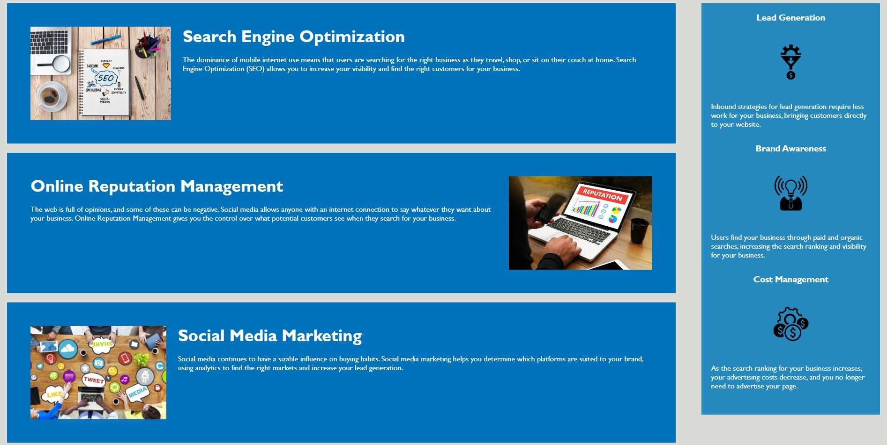

# code-refactor

## Description

This code-refactor was created to practice how to refact the base code to get more accessbility. It contains notes on HTML, CSS. 
I changed the base html code elements which are not inapposite for semanic and changed CSS selectors to match the elements which I changed. 
Also I merged and deleted some selectors to prevent repetition of code. 
I learned there is no need meaningless class or id attributes if the html semantic elements are well set up.

## Installation

N/A

## Usage
To understand the code that I changed, please read the comments in CSS file. 
To use this Horison webpage, click each item in navigation bar. Once you click, the webpage will go to section for each item that you click.

URL = https://kayden-hyunsikkim.github.io/1st-challenge-code-refactor/#social-media-marketing

## Credits

N/A

## License

N/A

